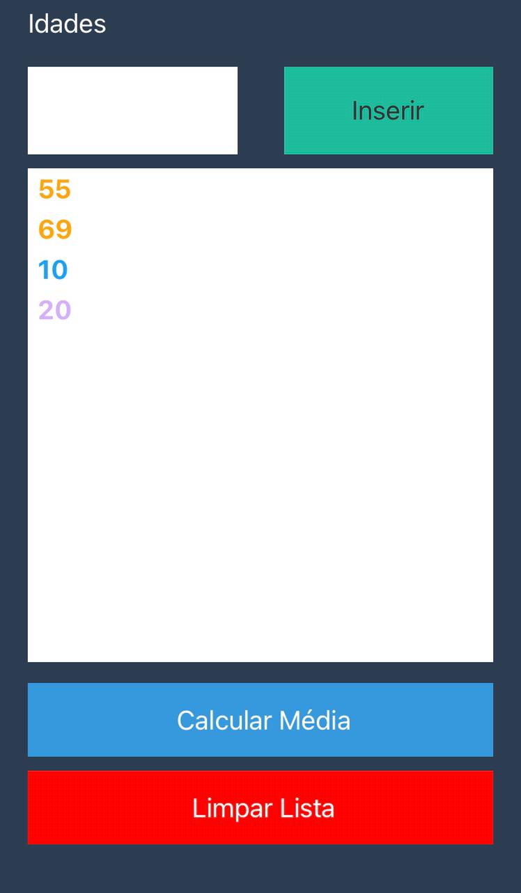

<h1 align="center">
  🚀 Média Aritmética
</h1>

Esse projeto foi desenvolvido com as seguintes tecnologias:

- [React](https://reactjs.org)
- [React Native](https://reactnative.dev/)

  

## 💻 Projeto

Média Aritmética é um projecto que tem como objectivo calcular a média dado
um conjunto de números.

## Instalação 

Para executar esse repositório baixe-o para sua maquina ou faça um `Git Clone`

### Rodando a aplicação

- abra a pasta na Shell (No windows Power Shell em modo administrador). 
- `$ expo install` esse comando ira instalar todos os módulos necessários ao React Native
-  `$ expo start` Ira iniciar o servidor na sua máquina 

Feito com ♥ by Apolinário Manuel
